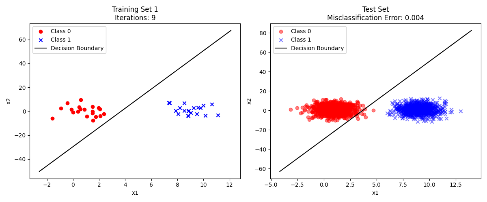

# Perceptron Classifier: Research and Implementation



This repository hosts an implementation of the Perceptron algorithm, a foundational linear classifier in machine learning. The project explores the algorithm's behavior across multiple training datasets, evaluates its convergence, and analyzes generalization performance on a test set. The code generates visualizations of decision boundaries and misclassification errors, providing insights into the model's learning process.

## Key Features
- **Perceptron Training**: Implements the standard Perceptron update rule for binary classification.
- **Multi-Dataset Evaluation**: Trains on 10 distinct training sets and evaluates performance on a unified test set.
- **Visualization**: Generates plots of decision boundaries for both training and test data.
- **Error Analysis**: Computes misclassification error rates and tracks convergence iterations.

## Algorithm Overview
The Perceptron algorithm, introduced by Rosenblatt (1957), is a linear classifier that iteratively adjusts weights to separate two classes. Key steps include:
1. **Weight Initialization**: Random initial weights.
2. **Misclassification Updates**: For each misclassified sample, update weights using:
   - \( w = w + x_i \) if \( y_i = 1 \) and misclassified.
   - \( w = w - x_i \) if \( y_i = 0 \) and misclassified.
3. **Convergence Check**: Stops when all samples are classified correctly or after `max_iterations`.

### Theoretical Background
The Perceptron Convergence Theorem guarantees convergence if the data is linearly separable. This project investigates scenarios where separability may vary across training sets.

**Key Observations**:
- Decision boundaries adapt to varying training data distributions.
- Low test errors (e.g., 0.028–0.030) indicate strong generalization despite non-separable cases.

### Summary of Training (Excerpt)
| Set | Iterations | Test Error |
|-----|------------|------------|
| 1   | 10         | 0.030      |
| 2   | 21         | 0.028      |
| ... | ...        | ...        |

## Installation & Usage
### Dependencies
- Python 3.8+
- `numpy`
- `matplotlib`

### Steps
1. Clone the repository:
   ```bash
   git clone https://github.com/yourusername/perceptron-classifier.git
   ```
2. Install dependencies:
   ```bash
   pip install numpy matplotlib
   ```
3. Run the main script:
   ```bash
   python main.py
   ```
4. Generated plots are saved to `plots/`.

## References
1. Rosenblatt, F. (1957). *The Perceptron: A Probabilistic Model for Information Storage and Organization in the Brain*. Psychological Review.
2. Bishop, C. M. (2006). *Pattern Recognition and Machine Learning*. Springer. (Chapter 4: Linear Models for Classification)

## Future Work
- Compare with kernelized or multi-layer Perceptrons.
- Integrate additional datasets for robustness analysis.
- Study the impact of learning rates and stochastic updates.
